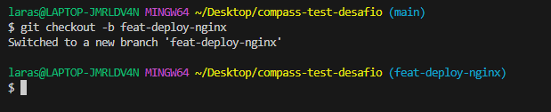
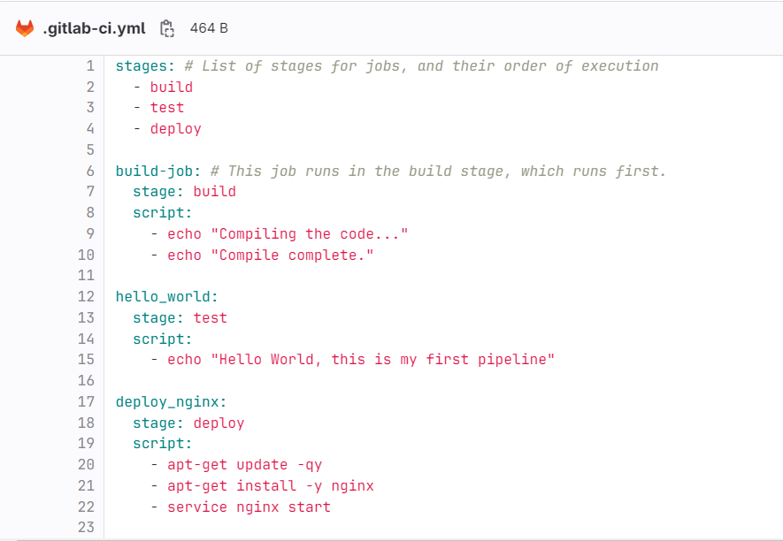
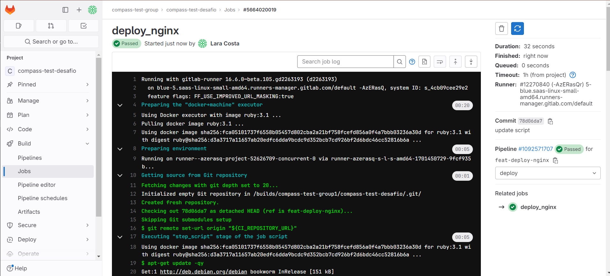

# compass-pipeline-nginx


### Pré-requisitos
- GitLab account
- [Projeto no GitLab](https://github.com/LaraCosta66/compass-gitlab-pipelines)

## Vscode
- Com seu projeto clonado, crie uma branch para implementar essa nova feature:
```
git checkout -b <NOME-BRANCH>
```


- Crie o arquivo **.gitlab-ci.yml**, e coloque as seguintes informações dentro do arquivo:

```
stages:
  - build
  - deploy

build-job: 
  stage: build
  script:
    - echo "Compiling the code..."
    - echo "Compile complete."

deploy_nginx:
  stage: deploy
  script:
    - apt-get update -qy
    - apt-get install -y nginx
    - service nginx start
```


### Faça Commit e envie as alterações para o repositório:
```
git status
git add . 
git commit -m 'feat: add nginx deploy '
git push origin feat-deploy-nginx
```

## GitLab

- Na barra lateral esquerda, clique em "**Build**" e depois em "**Pipeline**", você deve ver a pipeline sendo executada.

